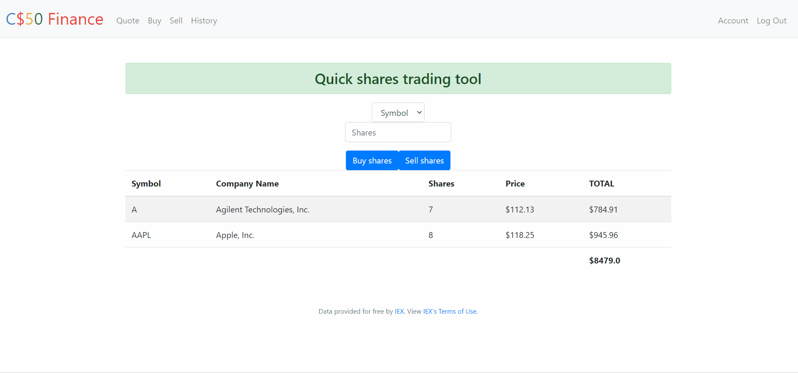

# Finance
Finance is part of Problem Set 8 in CS50 and challenges you to implement a web-app with Flask and an API (IEX Cloud) to simulate a stocks trading platform.


## Table of contents
* [General info](#general-info)
* [Technologies](#technologies)
* [Setup](#setup)
* [Inspiration](#inspiration)
* [Contact](#contact)

## General info
Finance is part of Problem Set 8 in CS50 and challenges you to implement a web-app with Flask and an API (IEX Cloud) to simulate a stocks trading platform.

## Example
Here is a quick view of its functionality:




## Technologies
The main technologies used are:
* Python 3 - version 3.8.5
* Flask - version 1.1.2
* Bootstrap - version 4.1.3

## Setup
This is you install python dependencies listed above:
```
mkdir my_project 
python -m venv my_project\venv 
my_project\venv\Scripts\activate.bat
pip install -r requirements.txt 

```


## Inspiration
This project is built upon instructions given in the CS50 course, which can be checked at:
https://finance.cs50.net/


## Contact
Created by [@AlexStan](https://github.com/alexstan12) - feel free to contact me!


